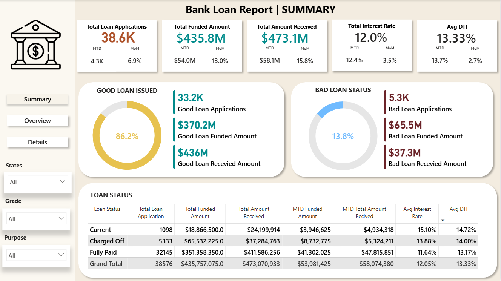
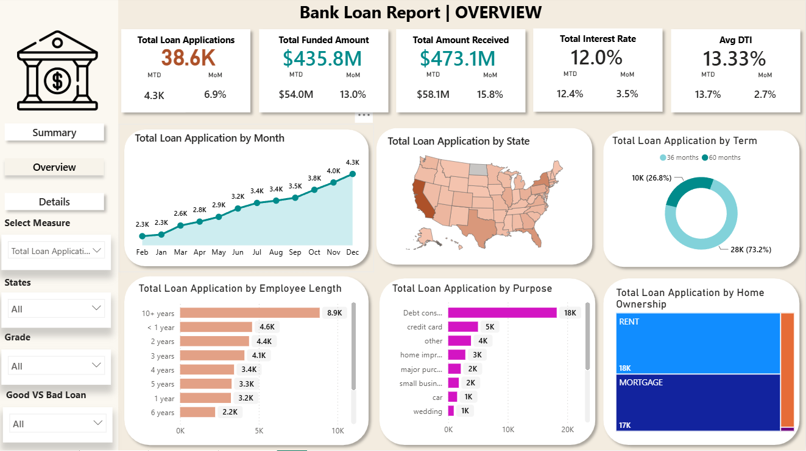
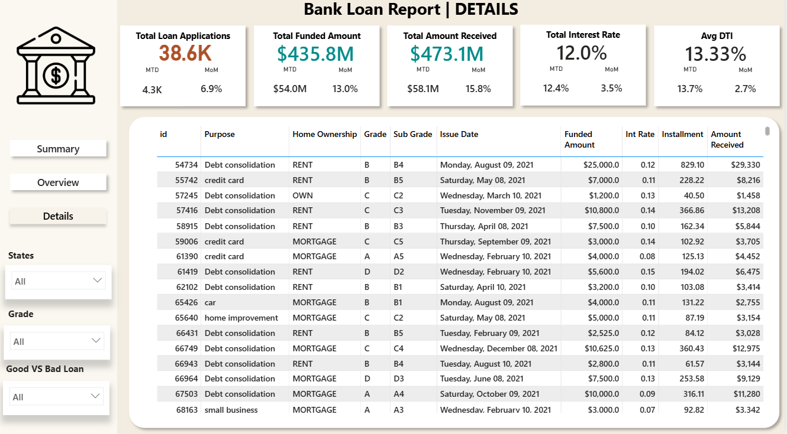

# 🏦 Bank Loan Analytics Project

An End-to-End Data Analytics and Business Intelligence Project built using **Excel, Python, SQL, and Power BI**.

This project transforms raw bank lending data into meaningful business insights through exploratory data analysis, SQL analytics, KPI creation, and interactive dashboard development.

---

## 🚀 Project Overview

The Bank Loan dataset contains detailed information about loan applications, borrowers, funded amounts, repayments, interest rates, and loan status.

The objective of this project was to transform raw loan operational data into a business intelligence solution capable of answering strategic business questions related to:

- Loan Application Trends
- Funded and Received Amounts
- Interest Rate & Debt-to-Income (DTI) Analysis
- Good Loan vs Bad Loan Performance
- Regional and Demographic Lending Patterns
- Borrower-Level Loan Details

---

## 📂 Dataset Structure

The dataset consists of loan-level records containing fields such as:

- Loan ID
- Purpose
- Home Ownership
- Grade & Sub Grade
- Issue Date
- Funded Amount
- Interest Rate
- Installment
- Amount Received
- Loan Status (Current, Fully Paid, Charged Off)
- Term, Employee Length, State

---

## 🛠️ Tools & Technologies

| Technology | Purpose |
|---|---|
| Excel | Initial Data Exploration & Reporting |
| Python | Exploratory Data Analysis (EDA) |
| SQL (MS SQL Server) | Data Storage & Business Analytics |
| Power BI | Dashboard Development |
| DAX | KPI & Measure Creation |
| Power Query | Data Modelling & Processing |

---

## 🔄 Project Workflow

### Stage 1: Exploratory Data Analysis (Excel & Python)

The project began with raw loan data containing borrower details, loan amounts, interest rates, and repayment information.

Using Excel and Python:

- Initial exploration of the dataset was performed to understand its structure and fields.
- Exploratory Data Analysis (EDA) was conducted using Python to study distributions, trends, and relationships across key variables such as loan amount, interest rate, term, purpose, and employee length.
- Summary statistics were generated to understand the overall shape of the loan portfolio.
- Insights from EDA guided the SQL queries and dashboard design in the later stages.

### Stage 2: Database Analytics (SQL - MS SQL Server)

The loan data was loaded into MS SQL Server for structured querying and business analysis.

Inside SQL Server:

- A database and tables were created to store the loan data.
- Business-oriented SQL queries were written to extract KPIs and trends.

**Advanced SQL Concepts Used:**

- SELECT & Filtering
- DATENAME, DATEPART, CAST
- Aggregate Functions (SUM, COUNT, DISTINCT)
- GROUP BY & ORDER BY
- CTEs (Common Table Expressions)
- Window Functions & PARTITION
- Month, Quarter, Day, Hour level Date Functions
- LIMIT / TOP Queries

---

## 📈 SQL Analysis Areas

**Loan Application Trends**
- Total Loan Applications (Overall, MTD, MoM)
- Good Loan vs Bad Loan Application Trends

**Funding & Repayment Analytics**
- Total Funded Amount vs Total Amount Received
- MTD Funded Amount and MTD Amount Received

**Risk Analytics**
- Average Interest Rate
- Average Debt-to-Income Ratio (DTI)

**Loan Status Analysis**
- Loan Performance by Status (Current, Fully Paid, Charged Off)

**Demographic & Regional Analytics**
- Loan Applications by State
- Loan Applications by Employee Length
- Loan Applications by Home Ownership
- Loan Applications by Purpose

---

## 📉 Power BI Development

The analysed loan data was imported into Power BI, where relationships, KPIs, and interactive visuals were created across a 3-page dashboard.

---

## 📌 DAX Measures Created

Custom DAX calculations were developed, including:

- Total Loan Applications
- Total Funded Amount
- Total Amount Received
- Average Interest Rate
- Average DTI
- MTD Loan Applications, Funded Amount & Amount Received
- MoM Change (%) for all key KPIs
- Good Loan Application Percentage
- Bad Loan Application Percentage

---

## 📊 Dashboard Modules

A 3-page interactive Power BI dashboard was developed:

### 1. Summary Dashboard

High-level KPI overview covering Total Loan Applications, Total Funded Amount, Total Amount Received, Average Interest Rate, and Average DTI (with MTD & MoM tracking). Includes a Good Loan vs Bad Loan breakdown and a Loan Status grid view (Current, Fully Paid, Charged Off).

### 2. Overview Dashboard

Visual breakdown of lending activity through:

- Monthly Trends by Issue Date (Line Chart)
- Regional Analysis by State (Filled Map)
- Loan Term Analysis (Donut Chart)
- Employee Length Analysis (Bar Chart)
- Loan Purpose Breakdown (Bar Chart)
- Home Ownership Analysis (Tree Map)

### 3. Details Dashboard

A comprehensive grid view providing borrower-level information including ID, Purpose, Home Ownership, Grade, Sub Grade, Issue Date, Funded Amount, Interest Rate, Installment, and Amount Received — serving as a one-stop reference for detailed loan-level insights.

---

## 💡 Key Business Insights

- Total loan applications stood at 38.6K, with a total funded amount of $435.8M and total amount received of $473.1M.
- Good Loans made up 86.2% of all applications ($370.2M funded), while Bad Loans (Charged Off) accounted for 13.8% ($65.5M funded), highlighting a strong overall loan portfolio.
- The average interest rate across all loans was 12.0%, with an average DTI of 13.33%.
- Loan applications showed a consistent month-over-month growth trend from February through December.
- 73.2% of loans were issued for a 36-month term, compared to 26.8% for 60-month terms.
- Debt consolidation was the leading loan purpose, followed by credit card and home improvement loans.
- Borrowers with 10+ years of employment length had the highest number of loan applications.
- Rent and Mortgage were the dominant home ownership categories among borrowers.

---

## 🎯 Skills Demonstrated

- Exploratory Data Analysis (EDA)
- Data Modelling
- SQL Analytics
- Business Intelligence
- Dashboard Design
- DAX Development
- Data Storytelling
- Insight Generation

